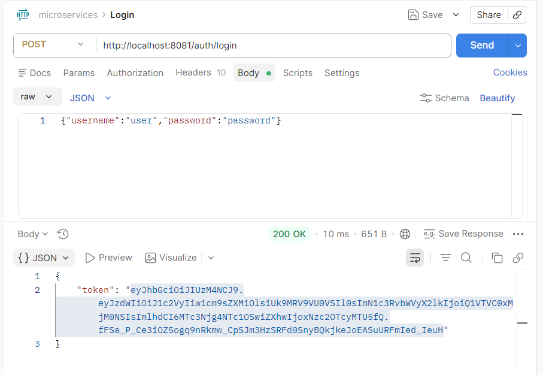
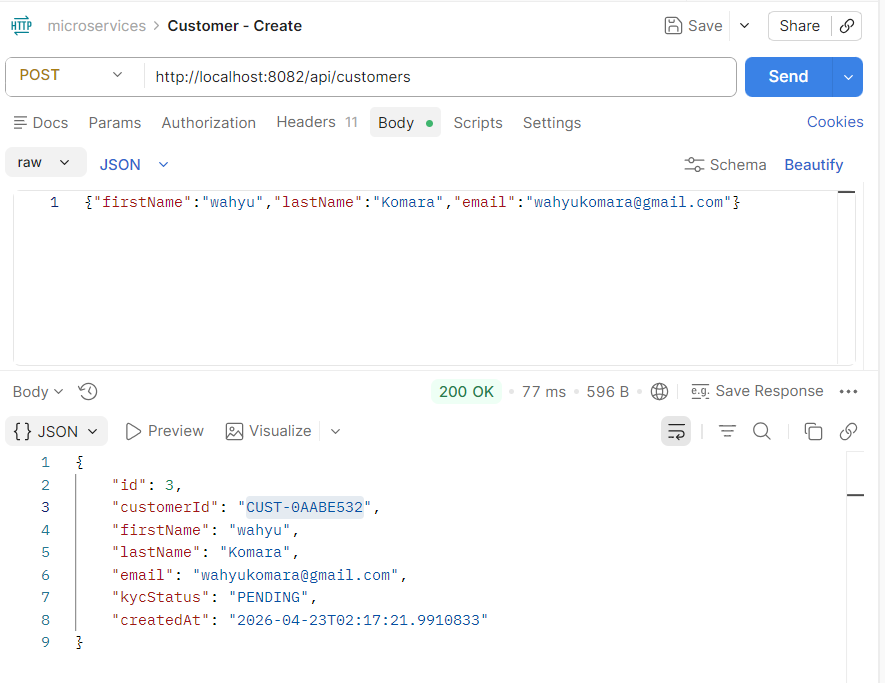
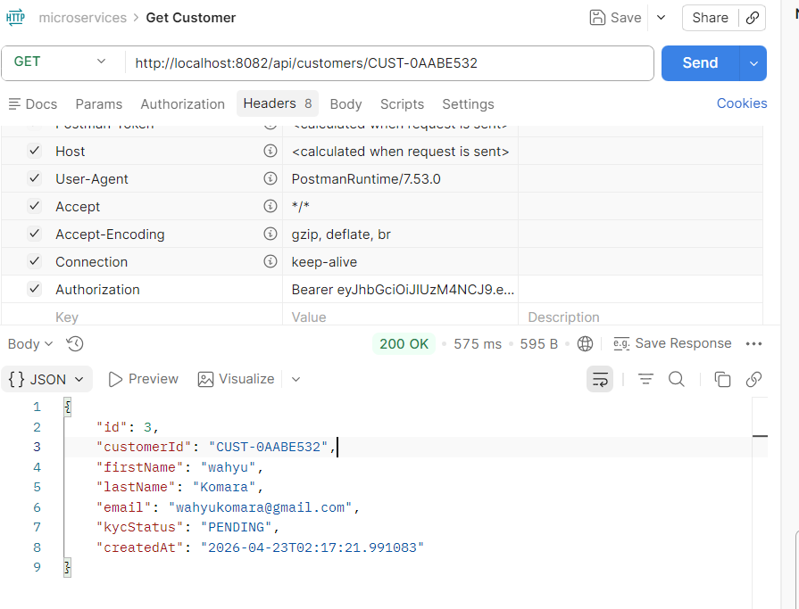
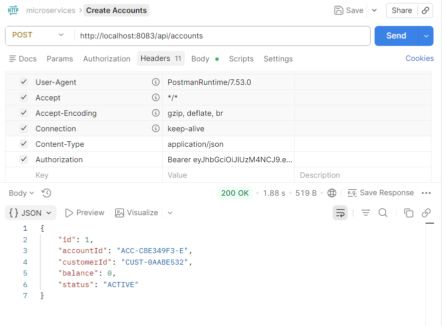
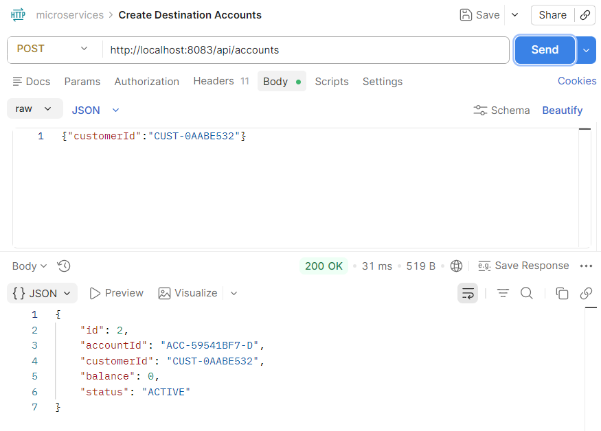
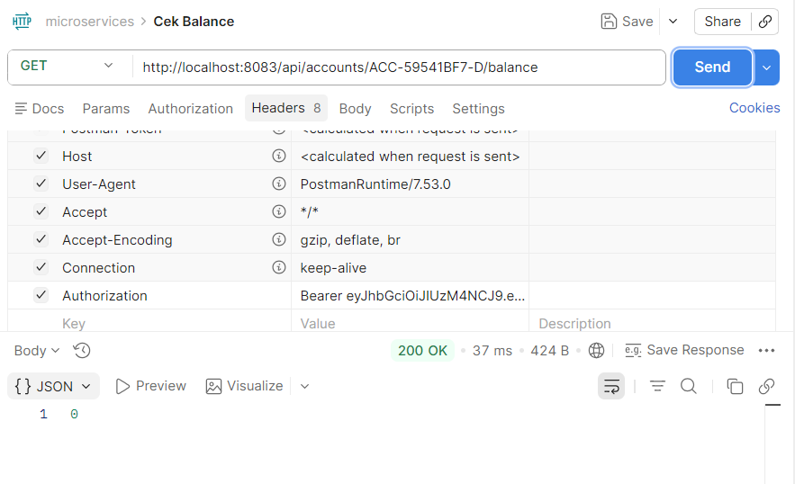
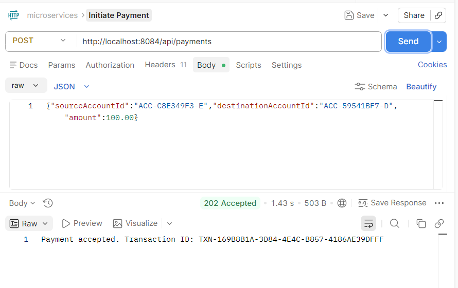
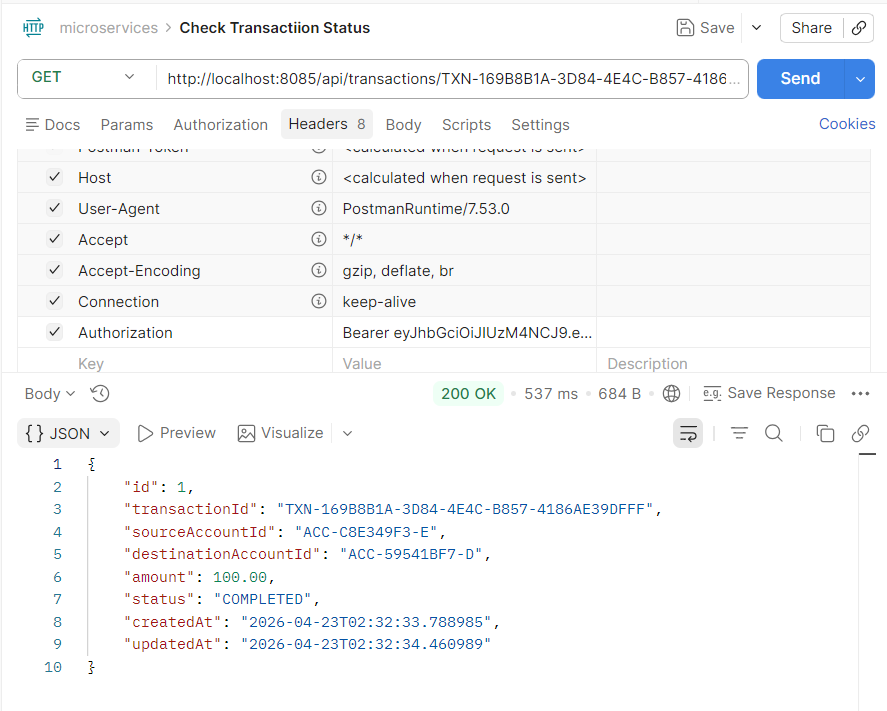

# 🏦 Online Banking Microservices

A production-ready, event-driven online banking system built with **Spring Boot 3.2**, **Spring Cloud**, **Apache Kafka**, and **JDK 21 Virtual Threads**. The system follows a stateless, distributed architecture using the **Choreography-based Saga Pattern** to ensure data consistency across microservices without a central orchestrator.

> **Design Philosophy:** If any service (like `payment-service`) restarts mid-process, the system remains consistent and no money "disappears."

---

## 📐 Architecture Overview

```
                         ┌──────────────┐
                         │  API Gateway │ :8090
                         │ (Spring Cloud│
                         │   Gateway)   │
                         └──────┬───────┘
                                │
                    ┌───────────┼───────────┐
                    │           │           │
              ┌─────▼────┐ ┌───▼────┐ ┌────▼─────┐
              │  Auth    │ │Customer│ │ Accounts │
              │ Service  │ │Service │ │ Service  │
              │  :8081   │ │ :8082  │ │  :8083   │
              └──────────┘ └────────┘ └──────────┘
                                           │
                                      Redis Cache
                                        :6380
              ┌──────────┐ ┌────────┐ ┌──────────┐
              │ Payment  │ │ Txn    │ │ Ledger   │
              │ Service  │ │Service │ │ Service  │
              │  :8084   │ │ :8085  │ │  :8086   │
              └────┬─────┘ └───▲──▲─┘ └──┬──▲────┘
                   │           │  │      │  │
                   └───► Kafka ◄──┘──────┘  │
                        :9092               │
                                     PostgreSQL
                                       :5434
```

All services register with **Eureka Discovery Server** (`:8761`).

---

## 🛠️ Tech Stack

| Category | Technology | Version |
|---|---|---|
| **Language** | Java | 21 (Virtual Threads) |
| **Framework** | Spring Boot | 3.2.4 |
| **Cloud** | Spring Cloud | 2023.0.1 |
| **Service Discovery** | Spring Cloud Netflix Eureka | — |
| **API Gateway** | Spring Cloud Gateway | — |
| **Config Management** | Spring Cloud Config | — |
| **Security** | Spring Security + JJWT | 0.12.5 |
| **Database** | PostgreSQL | 15 (Alpine) |
| **Cache** | Redis | 7 (Alpine) |
| **Messaging** | Apache Kafka | 3.7+ |
| **Resilience** | Resilience4j Circuit Breaker | — |
| **ORM** | Spring Data JPA + Hibernate | — |
| **Boilerplate** | Lombok | — |
| **Build** | Maven (Multi-module) | — |
| **Containers** | Docker / Docker Compose | — |

---

## 📦 Project Structure

```
OnlineBanking/
├── pom.xml                        # Parent POM (multi-module)
├── docker-compose.yml             # Local infrastructure
├── docker/
│   └── postgres-init.sh           # Auto-creates 4 databases on startup
│
├── discovery-service/             # Eureka Server (:8761)
├── config-service/                # Spring Cloud Config (:8888)
├── api-gateway/                   # Spring Cloud Gateway (:8090)
│
├── common-security/               # Shared JWT validation library
│   └── JwtValidationFilter.java
│   └── CommonSecurityConfig.java
│
├── common-events/                 # Shared Kafka DTOs
│   └── PaymentInitiatedEvent.java
│   └── LedgerUpdatedEvent.java
│
├── authorisation-service/         # OAuth2 JWT issuer (:8081)
├── customer-service/              # Customer profiles & KYC (:8082)
├── accounts-service/              # Account management + Redis cache (:8083)
├── payment-service/               # Payment initiation + Kafka producer (:8084)
├── transaction-service/           # Audit trail + Kafka consumer (:8085)
└── ledger-service/                # Double-entry bookkeeping (:8086)
```

---

## 🔐 Security Model

The system uses **stateless JWT authentication**:

1. Client calls `POST /auth/login` with credentials.
2. `authorisation-service` issues a signed JWT containing `roles` and `customer_id`.
3. All other services validate the JWT locally using the shared `common-security` library — **no inter-service auth calls needed**.

---

## 🔄 Event-Driven Saga (Payment Flow)

The system uses a **Choreography-based Saga Pattern** for distributed transactions:

```
Client ──► POST /api/payments
                │
                ▼
        payment-service
        Publishes: PaymentInitiatedEvent ──► Kafka [payments.initiated]
        Returns: 202 Accepted + transactionId
                                                    │
                            ┌───────────────────────┼───────────────────────┐
                            ▼                                               ▼
                   transaction-service                              ledger-service
                   Saves TransactionRecord                    ACID: DEBIT source +
                   status = PENDING                           CREDIT destination
                                                              Publishes: LedgerUpdatedEvent
                                                              ──► Kafka [ledger.updated]
                                                                        │
                            ┌───────────────────────┬───────────────────┘
                            ▼                       ▼
                   transaction-service       accounts-service
                   Updates status to         Updates balance in
                   COMPLETED or FAILED       PostgreSQL + Redis cache
```

### Kafka Topics

| Topic | Producer | Consumers |
|---|---|---|
| `payments.initiated` | payment-service | transaction-service, ledger-service |
| `ledger.updated` | ledger-service | transaction-service, accounts-service |

---

## 🗄️ Database Architecture

Each service has its own isolated PostgreSQL database (Database-per-Service pattern):

| Service | Database | Tables |
|---|---|---|
| customer-service | `customer_db` | `customers` |
| accounts-service | `accounts_db` | `accounts` |
| transaction-service | `transaction_db` | `transactions` |
| ledger-service | `ledger_db` | `ledger_entries` |

---

## 🚀 Getting Started

### Prerequisites

- **Java 21** (JDK)
- **Maven 3.8+**
- **Docker & Docker Compose**
- **Apache Kafka** (running natively or via Docker)

### 1. Clone & Install

```bash
cd d:\Tutorial\Antigrapity\AS400-CIF\java\OnlineBanking
mvn clean install -DskipTests
```

### 2. Start Infrastructure

```bash
# Start PostgreSQL (port 5434) and Redis (port 6380)
docker-compose up -d

# Verify databases were created
docker exec banking-postgres psql -U postgres -c "\l"
```

> **Note:** If you already have Kafka running natively on port `9092`, you're all set. If not, add Kafka/ZooKeeper to `docker-compose.yml`.

### 3. Start Services (in order)

Open separate terminals for each service:

```bash
# 1. Discovery Server (must start first)
mvn -pl discovery-service spring-boot:run

# 2. Config Server
mvn -pl config-service spring-boot:run

# 3. API Gateway
mvn -pl api-gateway spring-boot:run

# 4. Auth Service
mvn -pl authorisation-service spring-boot:run

# 5. Customer Service
mvn -pl customer-service spring-boot:run

# 6. Accounts Service
mvn -pl accounts-service spring-boot:run

# 7. Payment Service
mvn -pl payment-service spring-boot:run

# 8. Transaction Service
mvn -pl transaction-service spring-boot:run

# 9. Ledger Service
mvn -pl ledger-service spring-boot:run
```

### 4. Verify Services are Registered

Open Eureka Dashboard: [http://localhost:8761](http://localhost:8761)

---

## 🧪 Testing the API

### Step 1: Login and Get JWT Token

```powershell
$response = Invoke-RestMethod -Uri "http://localhost:8081/auth/login" `
  -Method POST -ContentType "application/json" `
  -Body '{"username":"user","password":"password"}'
$token = $response.token
Write-Host "Token: $token"
```

### Step 2: Create a Customer

```powershell
Invoke-RestMethod -Uri "http://localhost:8082/api/customers" `
  -Method POST -ContentType "application/json" `
  -Headers @{Authorization="Bearer $token"} `
  -Body '{"firstName":"John","lastName":"Doe","email":"john@example.com"}' | ConvertTo-Json
```

### Step 3: Create Bank Accounts

```powershell
# Source account
Invoke-RestMethod -Uri "http://localhost:8083/api/accounts" `
  -Method POST -ContentType "application/json" `
  -Headers @{Authorization="Bearer $token"} `
  -Body '{"customerId":"CUST-XXXXXXXX"}' | ConvertTo-Json

# Destination account
Invoke-RestMethod -Uri "http://localhost:8083/api/accounts" `
  -Method POST -ContentType "application/json" `
  -Headers @{Authorization="Bearer $token"} `
  -Body '{"customerId":"CUST-YYYYYYYY"}' | ConvertTo-Json
```

### Step 4: Check Balance

```powershell
Invoke-RestMethod -Uri "http://localhost:8083/api/accounts/ACC-XXXXXXXXXX/balance" `
  -Headers @{Authorization="Bearer $token"}
```

### Step 5: Initiate a Payment

```powershell
Invoke-RestMethod -Uri "http://localhost:8084/api/payments" `
  -Method POST -ContentType "application/json" `
  -Headers @{Authorization="Bearer $token"} `
  -Body '{"sourceAccountId":"ACC-XXX","destinationAccountId":"ACC-YYY","amount":100.00}'
```

### Step 6: Check Transaction Status

```powershell
Invoke-RestMethod -Uri "http://localhost:8085/api/transactions/TXN-XXXXXXXX" `
  -Headers @{Authorization="Bearer $token"} | ConvertTo-Json
```

---

## 📋 REST API Reference

### Authorisation Service (`:8081`)

| Method | Endpoint | Description | Auth |
|---|---|---|---|
| POST | `/auth/login` | Login, returns JWT | No |

### Customer Service (`:8082`)

| Method | Endpoint | Description | Auth |
|---|---|---|---|
| POST | `/api/customers` | Create customer | JWT |
| GET | `/api/customers/{customerId}` | Get customer | JWT |

### Accounts Service (`:8083`)

| Method | Endpoint | Description | Auth |
|---|---|---|---|
| POST | `/api/accounts` | Open account | JWT |
| GET | `/api/accounts/{accountId}/balance` | Get balance (Redis-first) | JWT |

### Payment Service (`:8084`)

| Method | Endpoint | Description | Auth |
|---|---|---|---|
| POST | `/api/payments` | Initiate transfer (returns 202) | JWT |

### Transaction Service (`:8085`)

| Method | Endpoint | Description | Auth |
|---|---|---|---|
| GET | `/api/transactions/{transactionId}` | Poll transaction status | JWT |

---

## ⚙️ Configuration

### Port Assignments

| Service | Port |
|---|---|
| Eureka Discovery | 8761 |
| Config Server | 8888 |
| API Gateway | 8090 |
| Auth Service | 8081 |
| Customer Service | 8082 |
| Accounts Service | 8083 |
| Payment Service | 8084 |
| Transaction Service | 8085 |
| Ledger Service | 8086 |
| PostgreSQL (Docker) | 5434 |
| Redis (Docker) | 6380 |
| Kafka (Native) | 9092 |

### Environment Variables

All services support configuration via environment variables:

| Variable | Default | Description |
|---|---|---|
| `DB_HOST` | `localhost` | PostgreSQL host |
| `DB_PORT` | `5434` | PostgreSQL port |
| `DB_USER` | `postgres` | Database username |
| `DB_PASSWORD` | `postgres` | Database password |
| `REDIS_HOST` | `localhost` | Redis host |
| `REDIS_PORT` | `6380` | Redis port |
| `KAFKA_BROKERS` | `localhost:9092` | Kafka bootstrap servers |

---

## 🏗️ Key Design Decisions

| Decision | Rationale |
|---|---|
| **Database-per-Service** | Loose coupling; each service owns its schema |
| **Choreography Saga** | No single point of failure (vs. Orchestration) |
| **Redis Cache** | Sub-millisecond balance lookups; graceful fallback to DB |
| **JDK 21 Virtual Threads** | High concurrency without thread pool tuning |
| **Idempotency Keys** | Prevents double-charging on network retries |
| **Circuit Breaker** | Payment service degrades gracefully under load |
| **Shared Security Library** | JWT validation without inter-service calls |
| **Lombok** | Eliminates boilerplate in JPA entities |

---

## 🧪 Manual Test Screenshots

End-to-end testing of the complete payment flow using Postman.

### 1. Login — Get JWT Token


### 2. Create Customer


### 3. Get Customer


### 4. Create Source Account


### 5. Create Destination Account


### 6. Check Balance


### 7. Initiate Payment


### 8. Check Transaction Status


---

## 📜 License

This project is for educational and demonstration purposes.
